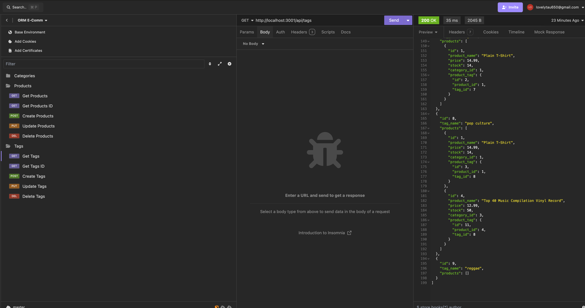

  # ORM-E-Comm

  

  ## Description
  In this project, I used Object-Relational Mapping(ORM) to build a backend for an e-commerce site. I got to work with mysql and express and created multiple routes to handle HTTP methods! I ran into some trouble with using my tags PUT request when I was recording the video walkthrough, so I tried to cut that part of the final walkthrough video.

  ## Table of Contents
  - [Installation](#installation)
  - [Usage](#usage)
  - [Credits](#credits)
  - [License](#license)
  - [Tests](#tests)
  - [Contact Information](#questions)

  ## Installation
  1) Clone repo 
  2) run npm install 
  3) source ./db/schema.sql 
  4) node run seeds/index.js 
  5) npm start

  ## Usage
  

  [Walk through video](https://drive.google.com/file/d/1vbIFIPQdlWreXBWIkRJemqm4sNNAYn1D/view?usp=sharing)

  ## Credits
  I re-watched our bootcamp cloud recordings for assistance with creating the routes: https://bootcampspot.instructure.com/courses/5093/external_tools/249

  I used the xpert AI tool when I ran into errors(specifically sql errors)
  
  Had some issues with my post request - referred to google/stack overflow:
  https://stackoverflow.com/questions/42393249/define-use-a-promise-in-express-post-route-on-node-js

  ## License
  
  This project is licensed under MIT License.

  
  https://opensource.org/licenses/MIT
  

  ## Tests
  

  ## Questions
  If you had any questions, please feel free to contact me at lovelytau650@gmail.com.
  Here is my GitHub profile link https://github.com/Love4Tau/ORM-E-Comm

  